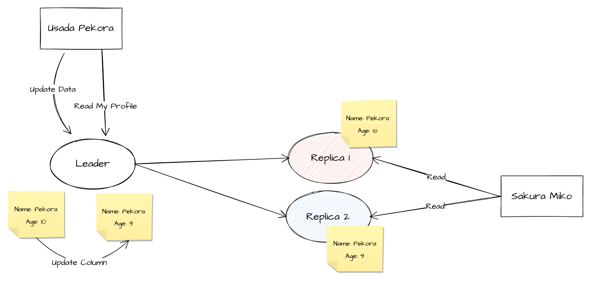

# Eventually Consistency
결과적 일관성, 최종 일관성은 일관성의 한 종류입니다. 이 문서에서는 Eventually Consistency에 대하여 설명합니다.

## Consistency
일관성은 쉽게말해, 정확성에 대한 내용입니다. 데이터를 가져오거나, 저장하는 과정에서 얼마나 정확하게 수행하며, 논리적인 이상함이 없는지 나타냅니다.

Consistency는 Transaction의 ACID중 C를 담당하고 있습니다. [The Transaction Concept](http://jimgray.azurewebsites.net/papers/thetransactionconcept.pdf) ([번역](https://johngrib.github.io/wiki/summary-the-transaction-concept)) 에서 볼 수 있듯, 데이터를 정확하게 계산하는 것은 매우 중요한 내용입니다. 만약 Transaction 도중 데이터가 변경되어서 이상한 값이 만들어진다면 우리는 Transaction을 사용할 필요가 없겠죠.

분산 시스템에서의 Consistency는 CAP 정리로 널리 알려져있습니다. CAP 정이와 관련한 정보는 [기계인간님의 블로그](https://johngrib.github.io/wiki/CAP-theorem/)를 참고하시길 바랍니다. 여러 인용 문구가 포함되어 CAP 정리를 이해하는데 도움이 됩니다.

## Strong Consistency
전통적인 Database에서 사용하는 것은 Strong consistency라고 부릅니다. 이는 우리가 Transaction에서 흔히 알고있는 일관성입니다. 데이터는 언제나 모두 업데이트 되어있으면서, 같은 데이터를 반환합니다. 업데이트 중이라면 일관성을 위하여 Lock을 사용할 수 있습니다. (Transaction Isolation참고)

이러한 일관성은 매우 자연스러우며, 우리가 원하는 종류의 일관성입니다. 모든 시스템이 이러한 일관성이 지켜진다면 좋겠죠.

## Weak Consistency
약한 Consistency는 값이 변경된 다음, 업데이트 된 값을 반환하지 않을 수도 있습니다. 올바른 값이 반환되기까지 몇가지 추가적인 조건이 합니다. 이 조건이 만족하고, 올바른 값이 반환되는게 보장되는 순간 사이의 기간을 불일치 기간이라고 합니다.

이는 Eventually Consistency와 매우 비슷합니다.

## Eventually Consistency
결과적 일관성(Eventually Consistency)는 Weak Consistency의 한 종류입니다. 모든 클라이언트는 올바는 값을 볼 수 있지만, 지연이 발생할 수 있으며 이 기간동안 이전 데이터가 보여질 수 있습니다.

이러한 결과적 일관성은 여러가지 변형을 만들 수도 있습니다.

위 이미지에서, Usada Pekora는 자신의 나이를 10살에서 9살로 변경하였습니다. 이 과정에서 모든 읽게 요청이 Replica에서 진행된다면 분명 자신이 업데이트한 내용이 적용되지 않을 수도 있습니다. 이러한 일관성의 불일치는 사용자 경험을 떨어트릴 수 있습니다. 따라서 자신의 데이터는 Leader에서 읽는 것으로 해결할 수 있습니다.

Sakura Miko의 경우에는 데이터가 변경되었다는 사실을 모릅니다. 따라서 이전 데이터가 보여져도 큰 어색함은 느끼지 못할 것입니다. 물론 Sakura Miko도 자신의 데이터는 Leader에서 읽어, 일관성을 보장할 수 있습니다. Sakura Miko가 모든 데이터를 Leader에서 읽으면 될 것 같지만, 이는 분산 시스템의 이점을 없애는 행동입니다.

## 참고 문헌

- https://www.allthingsdistributed.com/2008/12/eventually_consistent.html
- https://johngrib.github.io/wiki/summary-the-transaction-concept
- https://johngrib.github.io/wiki/CAP-theorem/
- https://dl.acm.org/doi/abs/10.1145/17356.17406
- https://www.cs.cornell.edu/courses/cs734/2000FA/cached%20papers/SessionGuaranteesPDIS_1.html
- https://people.eecs.berkeley.edu/~kubitron/courses/cs258-S08/handouts/papers/adve-isca90.pdf
