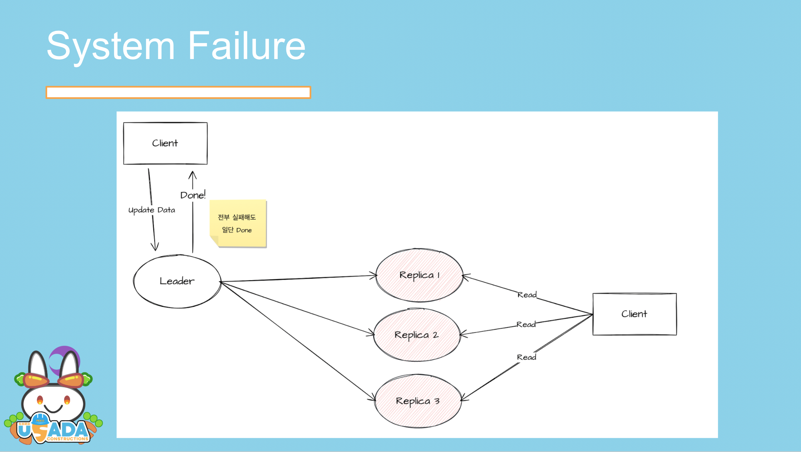

# Redis Cluster
Redis는 기본적으로 인메모리 데이터 스토어입니다. 우리는 Redis를 아주 많은 곳에 사용하죠. mission-critical한 Application에서도 Redis를 사용하는 경우가 있습니다. 그렇기에 Redis를 잘 사용하는 것이 중요해집니다.

이번에는 Redis의 가용성(availablity)을 높히는 Redis Cluster에 대하여 설명해볼까합니다.

## High Availablity
몇몇 시스템은 높은 가용성이 중요해집니다. Redis같은 중요한 컴포넌트가 99%의 가용성을 유지한다면 1%의 시간동안 시스템 장애가 발생할 수 있습니다. 그리고 그 1%의 장애도 용납 못하는 시스템이 존재합니다.

많은 시스템들은 최대한 안정적으로 유지되길 바랍니다. 그러나 우리가 예상할 수 없는 문제들로 인하여 심각한 결함이 발견될 수 있습니다. Redis가 갑자기 죽는 등의 문제가 대표적입니다. 따라서 우리 시스템은 특정한 Redis가 죽더라도 큰 문제없이 동작하기를 바랍니다.

이러한 높은 가용성을 유지하는 방법이 바로 Redis Cluster입니다.

## Replication
기본적으로 높은 가용성을 보장하는 가장 쉬운 방법은 시스템을 중복으로 배치하는 것입니다. 이런 이중화와 복제는 여러 복제본을 동기화하는 문제가 새롭게 등장합니다. Redis에서 어떻게 Replication(복제)를 수행하는지 살펴보겠습니다.

Primary Redis에 이미 데이터가 있고, 새로운 복제본을 추가하는 경우에 P(rimary) Redis를 FORK한다음, 모든 데이터를 Secondery Redis로 전달합니다.

> 이 과정에서 fork로 인한 메모리 사용량이 급증할 수 있습니다.
> 꼭 fork하지 않고 다른 방법을 사용해서 데이터를 전송할 수도 있습니다만, 트레이드 오프가 있습니다.

데이터의 동기화를 가장 처음에 맞추었다면, 변경된 내역을 계속에서 동기화해주어야합니다. 그 과정에서 Redis는 비동기식 복제를 사용합니다. 아래 이미지는 일반적인 Async Replication의 예시입니다.



이렇듯, Redis는 모든 복제본이 동기화되지 않아도 값을 변경하는데 성공합니다. 이는 Redis의 성능을 위해서 한 결정이며, Replication은 Evetually Consistency를 보장하게 됩니다.

Statement Based Replication를 사용하고있으며, 비결정적인 몇몇 함수는 Primary와 Replica에서 값이 달라질 수도 있습니다. 이는 Logical Log(binlog)기반의 MySQL과 비교하면 꽤나 다른 방식입니다.

이러한 Statement에는 각각의 ID가 부여되며, Primary와 Replica의 ID가 같다면 데이터가 전부 동기화 된 것으로 간주합니다.

너무 지루하게 복제 방법에 대한 이야기만 했네요.

## Failover

고가용성을 위하여 Replication을 진행했기에 Redis가 죽어도 시스템은 문제없이 동작해야합니다.

> 사실 Replication은 고가용성만을 위함은 아닙니다. Read의 경우 Replica에도 데이터가 있기에, 분산된 Redis로 처리할 수 있습니다.
> Write를 Primary가 충분히 버틸 수 있으며, Eventually Consistency만 보장해도 괜찮다면 성능을 위한 좋은 선택입니다.

Replica가 죽은 경우에는 어떻게 될까요? 부하 분산을 위해 만들었다면 슬플 수 있으나, 우리에겐 아직 Primary가 살아있습니다. Primary나 또다른 Replica에서 처리할 수 있습니다.

만약 Primary가 죽은 경우는 어떻게 될까요? 그런 경우에 합의 알고리즘에 의해 Replica중 하나가 Primary로 승격됩니다. Replica가 Primary와 데이터가 같다는 보장은 없지만 여전히 동작합니다. 만약 Redis가 하나였다면 시스템은 아예 동작하지 않았을거에요.

**Split Brain**

분산 시스템에서는 네트워크 파티션이 발생할 수 있으며, Primary가 아직 살아있거나 여러 Replica가 자신을 Primary라고 생각할 수 있습니다. 만약 이런 상황이라면 Redis Cluster는 잘 동작하지 않을 수 있습니다. 따라서 Redis Cluster에서는 이러한 Split Brain문제를 해결해야합니다.

https://redis.io/docs/reference/cluster-spec/#failure-detection

위 문서에는 Split Brain이 발생하지 않도록, 분산 합의 알고리즘을 통해 모든 노드가 동의해야 승격된다고 명시하고 있습니다. 일시적으로 여러 Replica가 자신이 Primary라고 인지할 수 있지만, 모든  노드의 동의를 받지 않았다면 승격 과정이 취소됩니다.

더 자세한 내용은 추후에 분산 합의와 Leader선택 문서에서 다루겠습니다.

## Partitioning

Redis Cluster를 쓰는 다른 이유는 파티셔닝입니다.

우리는 Redis의 메모리에 다 저장할 수 없는 데이터를 다뤄야합니다. 커다란 시스템이라면 더욱 그렇겠죠. 그렇다면 어떻게 할까요? Redis를 쓰지 않은 것도 방법이겠지만, 데이터를 나눠서 저장하는 것도 방법입니다. 우리는 그런 방법을 파티셔닝, 샤딩 등으로 부릅니다.

데이터를 나눠서 처리하기위해 어떤 데이터가 어떤 노드에 위치되었는지 알아야합니다. 우리는 주로 Consistency Hashing을 사용합니다. 간단하게 말해서 Ring을 만들고 구간을 지정해서 데이터의 위치를 지정하는 방식입니다. 자세한 내용은 [일관된 해싱](../distributedsystem/consistancy-hashing.md)

Redis Cluster는 일반적인 일관된 해싱을 사용하지 않습니다. 다만 그와 유사한 해시 슬롯이라는 개념을 사용합니다. Redis Cluster는 Key의 대괄호 안의 부분 (`KEY{HASH_TARGET}KEY`)을 CRC16이라는 알고리즘으로 해싱합니다. 그 결과 0부터 16383까지의 결과값이 나오게됩니다.

노드는 각각 0~1000, 1001~2003, 2004~16383처럼 해시 값 범위를 지정받게 됩니다. 노드들은 데이터를 저장할 때 Key를 살펴보고 자신의 해시 범위의 값만 저장합니다. 만약 자신의 범위가 아니라면 다른 노드로 이동하라고 이야기하며 요청이 실패합니다.

> 요청이 실패한 경우 MOVED라는 결과가 데이터를 저장해야하는 다른 노드 위치와 함께 반환되며, Redis Client가 다른 노드에 다시 쓰기 작업을 수행해야합니다.
> 만약 이 내용이 클라이언트 라이브러리에서 지원되지 않는다면, 직접 수행해야합니다.

**Re Partitioning**

파티셔닝의 경우 노드가 부족해서 새로운 노드를 추가해야하는 경우가 생깁니다. 그 경우에 개발자가 직접 Redis Cluster에 등록해주어야하며, 새로운 노드가 맡아야하는 해시 값의 범위를 지정해줘야합니다.

이 경우 다른 노드들과 해시 범위 조정이 일어나며, 데이터 일부에 대한 Replication이 진행됩니다.

## Gossip Protocol & BroadCast

우리는 이전에 Redis Cluster의 노드는 자신의 해시 범위를 벗어하는 데이터가 들어온 경우 MOVED와 함께 새로운 Destination을 반환한다고 하였습니다. 또한 Re Partitioning하는 경우에도 해시 키의 범위가 변경되어야합니다. 어떻게 다른 노드의 설정을 알 수 있는걸까요?

Redis Cluster는 Gossip Protocol을 사용하여 서로 통신합니다. Gossip을 주고받는 동안 서로의 Heart Beat을 보내며 failure도 체크하지만, 현재 공유되고 있는 설정이 업데이트 되었는지도 같이 전달합니다.

> Gossip Protocol에 대하여 여기에서 자세히 다루지는 않습니다만, 노드끼리 데이터를 전달하는 방법이라고 알아두시면 좋을 것 같습니다.

Redis Cluster는 이러한 설정마다 configEpoch라는 단조 증가 값을 사용해서 최신 상태인지를 판단합니다. 만약 configEpoch가 더 작은 값이라면 그 설정은 변경된 것으로 간주하고 새로운 값으로 적용합니다.

configEpoch는 failover시에도 증가되고, 개발자가 직접 리샤딩하는 경우에도 증가됩니다. configEpoch 전파가 충분히 빠르다면 이상적이지만, 현실세계는 그렇지 않습니다. 분산 시스템에서는 뭐든지 잘못될 수 있고, 동일한 configEpoch가 등장하여 충돌될 수도 있습니다. Redis Cluster는 이 문제를 꼭 해결해야합니다. 다른 설정 2개가 존재하면 잘못 동작할 수 있으니까요.

분산 합의 알고리즘으로 failover되는 경우에 모든 노드가 최종 상태에 동의해야하기에 configEpoch는 고유한 값이 보장됩니다. 하지만 개발자가 직접 트리거하는 변경은 충돌을 야기할 수 있습니다. ` CLUSTER FAILOVER [TAKEOVER]`커맨드는 Epoch를 강제로 변경하기에 충돌이 발생합니다.

만약 이렇게 충돌이 발생한 경우에는 [configEpoch 충돌 해결 알고리즘](https://redis.io/docs/reference/cluster-spec/#configepoch-conflicts-resolution-algorithm)을 통해서 하나의 버전이 승리합니다.

```
1. 마스터 노드가 같은 configEpoch를 가진 또다른 마스터 노드를 발견합니다.
2. 같은 configEpoch를 가진 노드의 ID를 비교해서 사전학적으로 작은 노드를 선택합니다.
3. 선택된 노드의 currentEpoch를 1 증가시키고, 새로운 configEpoch를 발행합니다.

* 사전학적으로 = lexicographically
-> 아마도 abcd,1234와 같은 대소 비교를 하는 것 같습니다.
-> 현재 충돌이 발생했고, 어떤 노드가 더 맞는 값인지 판단할 수 없습니다. 따라서 단순하게 어떤 값으로 수렴하면 충분합니다. 그래서 노드의 ID의 대소비교를 통해서 선택합니다.
```

**currentEpoch?**

이전에는 configEpoch만 등장했지만, 갑자기 currentEpoch가 등장하였습니다. 이 currentEpoch는 Redis Cluster의 브로드캐스트 알고리즘에서 중요한 역할을 합니다. 이 문단에서는 이 currentEpoch를 좀 더 알아봅니다.

분산 합의 알고리즘에는 여러가지가 있습니다. Paxos, Raft, ZAP과 같은 많은 알고리즘들이 사용되고 있습니다. Paxos는 Cassandra에서, Raft는 etcd, ZAP은 ZooKeeper Atomic Broadcast로 사용됩니다. 이러한 분산 합의 알고리즘은 Leader선출 과정에서 사용되며, 요청의 순서를 정할 때도 사용됩니다. (Total Order Broadcast)

Redis Cluster의 경우 Full Mesh(노드가 다른 모든 노드와 연결되어있는)구조를 채택하고 있습니다. 이렇게 연결된 노드 사이에서 Gossip Protocol을 사용해서 heartbeat를 체크하고, 설정을 업데이트합니다. 즉, 설정 변경을 Gossip Protocol로 Broadcast합니다.

각 노드는 포트를 열고, 이 포트로 노드끼리 데이터를 교환합니다. 이 과정에서 `CLUSTER MEET`이라는 커맨드를 사용합니다.

이렇게 노드끼리 통신하는 방법을 Redis에서는 [Cluster Bus](https://redis.io/docs/reference/cluster-spec/#the-cluster-bus)라고 부르며, 연결되어 있는 방법은 Cluster Topology라고합니다. 이 케이스에서 Topology는 FullMesh가 됩니다.

데이터를 교환하는 경우, 설정도 같이 업데이트됩니다. 이러한 설정이 변경되었는지 configEpoch로도 알 수 있지만, 기본적으로 currentEpoch를 사용합니다. currentEpoch는 64비트 unsigned int값이며 각 이벤트에 단조 증가 버전을 의미합니다.

서로 가십을 주고받는 상황에서 만약 자신의 currentEpoch가 더 작다면 더 큰 currentEpoch을 선택합니다. 이렇게 가십을 주고받으면서 모든 노드는 가장 큰 값의 currentEpoch를 갖도록 합의합니다.

**Election & Promotion**

failover상황에서 어떻게 replica를 primary로 승격하는지 알아봅시다.

선거 과정은 replica에서 진행됩니다. 가십을 주고받으면서 어떤 replica가 primary에 보낸 heartbeat의 실패가 확인되었습니다. 아마도 primary가 죽은 것 같습니다. 우리는 이제 failover가 진행되어야합니다. 매우 신속하고 정확하게 failover가 수행되어야지 시스템에 큰 문제가 없습니다.

```
Replica는 다음 3가지 상황에서 선거를 시작할 수 있습니다.

1. Replica의 Primary가 FAIL상태입니다.
2. Primary가 0이 아닌 수의 슬롯을 사용합니다.
3. Replication을 위한 Primary와 Replica의 link가 Primary로부터 주어진 시간보다 길게 끊겨있습니다. 
```

Replica는 문제가 발견되었더라도 바로 선거를 시작하지 않습니다. Replica들은 아래 정의된 시간만큼 대기한다음 선거를 시작합니다. 정의에서 `REPLICA_RANK`는 Replica가 Primary의 요청을 얼마나 많이 처리했는지를 나타냅니다. 즉, Primary의 offset과 Replica의 offset의 차이만큼 더 기다리게됩니다. 따라서 Replica가 Primary와 데이터가 비슷할수록 먼저 실행됩니다.

```
DELAY = 500 milliseconds + random delay between 0 and 500 milliseconds +
        REPLICA_RANK * 1000 milliseconds.
```

드디어 Replica는 선거를 시작합니다. currentEpoch를 하나 올리고 Primary 노드`들`에게 투표를 요청합니다. 이 요청은 가십을 주고받으면서 진행되며, `FAILOVER_AUTH_REQUEST`를 모든 Primary 노드들에게 전달합니다. 그리고 `NODE_TIMEOUT`의 2배만큼(최소 2초 이상) 기다립니다.

Primary는 `FAILOVER_AUTH_ACK`를 통해 Replica에 찬성을 응답합니다. 한번 찬성으로 투표하면 `NODE_TIMEOUT`의 2배만큼 다른 Replica에 투표할 수 없습니다. 이런 제한은 Split Brain을 완벽히 막지는 못하지만, 문제를 해결하는데 도움이 됩니다.

Replica는 `FAILOVER_AUTH_ACK`를 전달받으면 currentEpoch를 비교해서 작은 `FAILOVER_AUTH_ACK`들을 전부 무시합니다. 따라서 가장 마지막에 전달된 투표 결과만 적용됩니다. Replica가 대부분의 Primary로부터 찬성받으면 선거에서 승리합니다. 만약 일정한 시간안에 과반수의 선택을 받지 못했다면 선거가 중단되고 새로운 선거가 다시 시작됩니다.

Primary입장에서는 어떤 Replica가 가장 적절한지 계산하지 않습니다. Replica들은 Primary와 가까울수록 더 빨리 선거를 시작할 것이고, 선거에서 이길 가능성이 높습니다. 최선의 Replica를 Primary가 선택하지 않지만, 모든 선거에 꼭 찬성하는 것은 아닙니다. Primary는 다음과 같은 조건이 충족되어야먄 선거에 찬성합니다.

```
1. Primary는 한 epoch에 한번만 투표합니다. 찬성할 시, lastVoteEpoch라는 필드를 디스크에 저장하는 방식으로 보장합니다.
    1.1 Primary는 투표 요청이 lastVoteEpoch보다 작은 경우에는 투표하지 않습니다.

2. 투표할 권리를 가진 Primary는 승격될 Replica의 Primary가 FAIL인 경우에만 투표합니다.
3. Primary는 currentEpoch보다 작은 투표 요청을 무시합니다. 또한 요청과 같은 currentEpoch를 반환합니다.
    3.1 Replica는 새로운 투표 요청을 보낼 시, currentEpoch를 증가시킵니다.
	3.2 따라서 예전 선거의 찬성 요청은 새로운 선거의 currentEpoch보다 작다는게 보장됩니다.
	3.3 만약 이렇지 않는다면 투표 결과가 지연되는 경우 오래된 투표가 유효하다고 오해할 수 있습니다.


* 그 외에 3가지 추가적인 조건이 있습니다. 곧 추가해볼게요!
```

장애 상황과 전파, 승격까지 길었네요.

## Wrap up

Redis Cluster는 매우 재미있는 분산 데이터 저장소입니다. Replication을 통해 High Availablity를 달성합니다. 많은 데이터에도 사용할 수 있도록 파티셔닝으로 여러 노드들이 데이터를 분산해서 저장합니다. 여러 노드들간의 Heartbeat나 설정 공유들은 클러스터 버스라는 방식으로 가십을 주고받으며 수행됩니다. 그리고 여러 장애시에 승격을 진행하거나, 리샤딩을 위한 분산 합의도 살펴보았습니다.

Redis Cluster는 정말 재밌는 것 같아요.

## See Also
- https://redis.io/docs/reference/cluster-spec/
- https://redis.io/docs/manual/replication/
- https://redis.io/docs/manual/scaling/
- https://redis.io/commands/cluster-failover/
- https://github.com/redis/redis/issues/8948 (Redis Cluster V2 프로젝트!)
